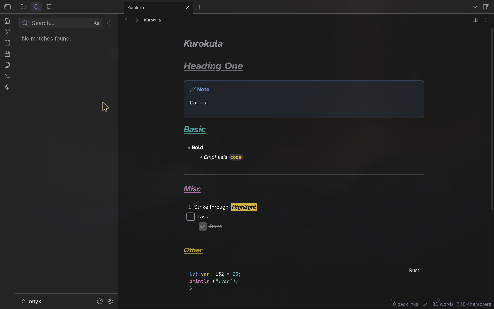

# Kurokula

> [!NOTE] Referenced the [Dracula Official Theme](https://github.com/dracula/obsidian) as starting point. Thank you, [chrismettal](https://gitlab.com/chrismettal)! 🙇

Color theme branched from [**darcula**](https://github.com/helix-editor/helix/blob/master/runtime/themes/darcula.toml). It didn't merely adopt the darkness, it was born in it!

---

- [Theme](https://help.obsidian.md/Extending+Obsidian/Themes)
- [Theme Guidelines](https://docs.obsidian.md/Themes/App+themes/Theme+guidelines)
- [Build Theme](https://docs.obsidian.md/Themes/App+themes/Build+a+theme)
- [Submit Theme](https://docs.obsidian.md/Themes/App+themes/Submit+your+theme)
